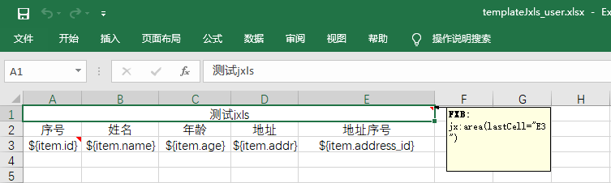
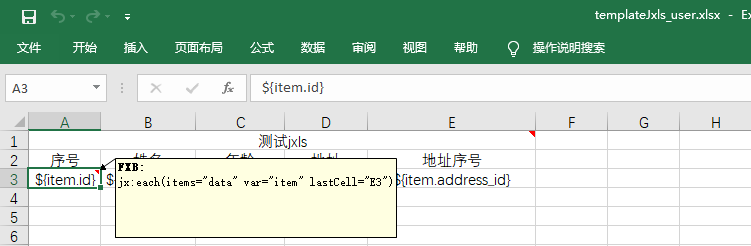

 - 创建springboot项目
    - 引入依赖
      -  `<dependency>
            <groupId>org.jxls</groupId>
            <artifactId>jxls</artifactId>
            <version>2.6.0</version>
        </dependency>`
	  - `<dependency>
            <groupId>net.sf.jxls</groupId>
            <artifactId>jxls-reader</artifactId>
            <version>1.0.6</version>
        </dependency>`

 - 创建实体类
   

	  ``` 
	@Data
	@Entity
	@Table(name = "sys_users")
	public class SysUsers {

		@Id
		@GeneratedValue(strategy = GenerationType.IDENTITY)
		@Column(name = "id")
		private Integer id;

		@Column(name = "name")
		private String name;

		@Column(name = "age")
		private Integer age;

		@Column(name = "addr")
		private String addr;

		@Column(name = "address_id")
		private Long address_id;
	```
	  此处使用lombok中@Data注解生产getter()、setter()方法。
  - 编写请求接口

	``` 
	@GetMapping("/get/user/export")
		public void getUserExport(HttpServletResponse response){
			List<SysUsers> sysUsersList = sysUserJxlsService.list();
			Context context = new Context();
			context.putVar("data",sysUsersList);
			response.setHeader("content-Type", "application/vnd.ms-excel");
			String fileName = "用户信息"  + DateTimeHelper.formatToString(new Date(),"yyyy_MM_dd") + ".xlsx";
			try {
				//response.setHeader("Content-Disposition", "attachment:filename=" + URLEncoder.encode(fileName, "utf-8"));
				response.setHeader("Content-Disposition", "attachment;filename=" + URLEncoder.encode(fileName, "utf-8"));
				OutputStream outputStream = response.getOutputStream();
				InputStream inputStream = getClass().getClassLoader().getResourceAsStream("excel/templateJxls_user.xlsx");
				JxlsHelper.getInstance().processTemplate(inputStream,outputStream,context);
			} catch (Exception e) {
				e.printStackTrace();
			}
		}
	```
	sysUserJxlsService.list();是调用service层获取数据列表方法，此处不多说明，然后得到List<SysUsers>数组；
	创建Context对象，调用.putVar("data",sysUsersList);方法将数组传入，“data”值需要注意，在下文创建excel模板的时候会用到。
	`excel/templateJxls_user.xlsx`这个是获取项目中对应的Excel模板的相对路径。
- 创建Excel模板
	
	首先创建与实体类属性对应的标题，在工作表的第一个单元格插入批注`jx:area(lastCell="E3")`,代表区域从A1到E3。
	
	其次在数据开始的第一个单元格插入批注`jx:each(items="data" var="item" lastCell="E3")`，其中“data”就是之前Context对象传入数据时候的值，item代表循环时的元素，数据用 item.字段名 得到，要与实体类中属性名一致，E3代表结束区域。
- 创建启动类，运行项目，访问[http://localhost:8080/get/user/export](http://localhost:8080/get/user/export)导出数据