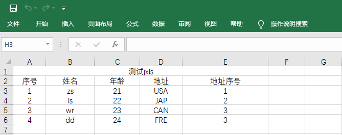

 - 创建springboot项目
    - 引入依赖
      -  `<dependency>
            <groupId>org.jxls</groupId>
            <artifactId>jxls</artifactId>
            <version>2.6.0</version>
        </dependency>`
	  - `<dependency>
            <groupId>net.sf.jxls</groupId>
            <artifactId>jxls-reader</artifactId>
            <version>1.0.6</version>
        </dependency>`
	
 - 编辑Excel导入模板
   
   
 - 根据Excel模板编辑xml文件
	``` 
	<?xml version="1.0" encoding="UTF-8"?>
	<workbook>
		<worksheet name="Sheet1">
			<section startRow="0" endRow="1"/>
			<loop startRow="2" endRow="2" items="sysUsersList" var="sysUsers" varType="com.zjw.entity.SysUsers">
				<section startRow="1" endRow="1">
					<mapping row="1" col="0">sysUsers.id</mapping>
					<mapping row="1" col="1">sysUsers.name</mapping>
					<mapping row="1" col="2">sysUsers.age</mapping>
					<mapping row="1" col="3">sysUsers.addr</mapping>
					<mapping row="1" col="4">sysUsers.address_id</mapping>
				</section>
				<loopbreakcondition>
					<rowcheck offset="0">
						<cellcheck offset="0"></cellcheck>
					</rowcheck>
				</loopbreakcondition>
			</loop>
		</worksheet>
	</workbook>
	```
	第一个name代表的是选用Excel里哪一个工作表的名称；
	section中就是标题的范围，占了多少行，在解析数据时给忽略掉，我的Excel中的标题是占了第一行，所以是从第0开始到1结束；
	loop中就是代表需要循环统计数据了，我的数据是从第3行开始，所以startRow=“2”，由于是一行一行循环的，所以endRow甜一样就好了；
	items中的值需要注意，在之后编写代码时用到，也就是最后赋值到实体类的集合；
	var代表循环时数据的名称，varType就是对应实体类的相对路径；
	loop中的section就是从循环中开始范围，都用1就好了；
	mapping就是Excel表每一行每一个单元格在实体类中字段的对应，将数据与实体类中属性对应上了可以了。
	loopbreakcondition中就是循环结束的判断，需要遇到什么结束在其中设置，此处代表遇到空值就结束。
	
- 编写接收接口
	``` 
	@PostMapping("/post/user/import")
		public void postUserImport(MultipartFile file){
			List<SysUsers> sysUsersList = new ArrayList<>();
			try {
				InputStream inputStreamXML = new BufferedInputStream(getClass().getClassLoader().getResourceAsStream("UserJxls.xml"));
				XLSReader xlsReader = ReaderBuilder.buildFromXML(inputStreamXML);
				InputStream inputStream = new BufferedInputStream(file.getInputStream());

				SysUsers sysUsers = new SysUsers();
				Map<String,Object> map = new HashMap<>();
				map.put("sysUsers",sysUsers);
				map.put("sysUsersList",sysUsersList);
				xlsReader.read(inputStream,map);
				sysUserJxlsService.createAll(sysUsersList);
			}catch (Exception e){
				e.printStackTrace();
			}
		}
	```
	sysUsersList 就是对应xml中items，最后会把数据都赋值到集合中；
	inputStreamXML就是加载xml文件，传入的值UserJxls.xml是文件坐所在的相对路径；
	inputStream是读取接受到MultipartFile文件流，Excel文件就是用MultipartFile类型接收；
	sysUsers创建实体类对象，再创建Map对象，将实体类和实体类集合添加到Map中，key值域xml中var的值和items的值对应；
	xlsReader.read(inputStream,map);使用该方法，是数据读取到实体类集合中，此时sysUsersList就是Excel中的数据了。