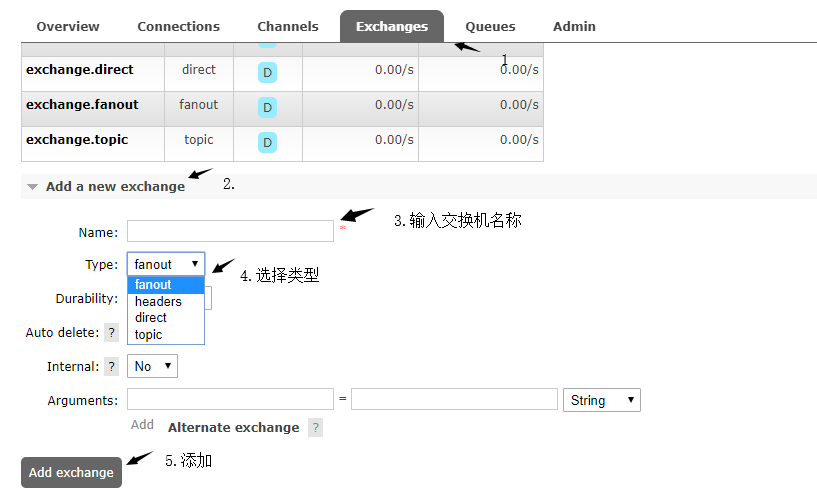
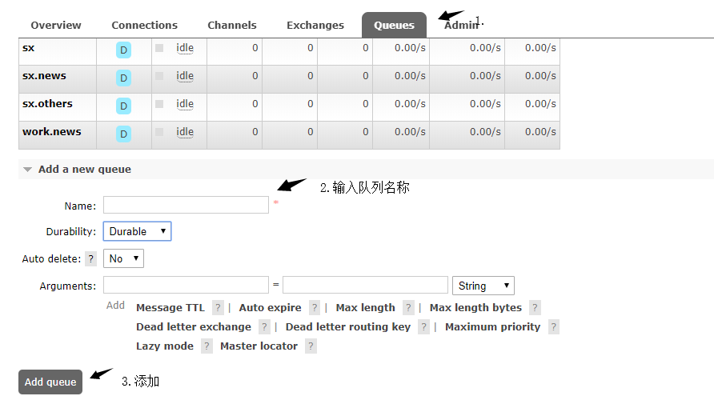
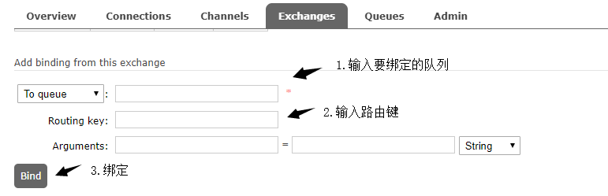

```
title：springboot整合rabbitmq
tags：springboot,rabbitmq
grammar_zjwJava：true
```

- 首先，需要安装好rabbitmq，再开启web页面管理，这里不多说明。

- 创建Springboot项目，引入依赖

  - ```
    <dependency>
            <groupId>org.springframework.boot</groupId>
            <artifactId>spring-boot-starter-web</artifactId>
    </dependency>
    <dependency>
            <groupId>org.springframework.boot</groupId>
            <artifactId>spring-boot-starter-amqp</artifactId>
    </dependency>
    ```

    这里springboot用的是<version>2.1.3.RELEASE</version>版本。

  - ```
    spring:
      rabbitmq:
        host: 127.0.0.1
    ```

    配置yml文件，指明rabbitmq服务器地址。

- 创建rabbitmq交换器和队列

  - web页面管理中创建(访问：http://ip:15672，默认账号：guest，密码guest)
    - 创建交换器
      - 
    - 创建队列
      - 
    - 交换器绑定队列
      - 
      - 需要点击要进行绑定的交换器，然后再进行绑定，路由键就是消息到达交换器后的匹配规则，将消息放到与交换器绑定的队列且满足匹配规则的路由键的队列中，每种交换器都不同。

  - 代码创建

    - ```java
      @Autowired
      AmqpAdmin amqpAdmin;
      
      public void Admin(){
          amqpAdmin.declareExchange(new DirectExchange("admin.direct"));
          amqpAdmin.declareQueue(new Queue("admin.queue",true));
          amqpAdmin.declareBinding(new Binding("admin.queue",Binding.DestinationType.QUEUE,"admin.direct","admin.queue",null));
      }
      ```

    - 注入AmqpAdmin，declareExchange();创建交换器，new一个类型的换器，指定名称后传入；declareQueue();创建队列，new一个队列，指定名称和是否持久化后传入；declareBinding();创建绑定规则，new一个绑定规则，指明队列名称、类型、交换器名称、路由键、参数说明后传入，这里没有添加参数说明，传入null，这样就创建了一个交换器，一个队列，并且进行了绑定。

- 创建配置文件

  - ```java
    @Configuration
    public class AMQPConfig {
    
        @Bean
        public MessageConverter messageConverter(){
            return new Jackson2JsonMessageConverter();
        }
    }
    ```

    配置文件设置序列化规则为json，如果不设置，对象序列化传输显示不是原来的形式。

- 发送消息和接收

  - 创建实体类(这里发送实体类数据)

    - ```
      public class Book {
          private String bookName;
          private String author;
      }
      ```

  - 创建controller中发送消息接口

    - ```java
      @GetMapping("/send")
          public String get(Book book){
              rabbitMQService.sendMsg(book);
              return "success";
      }
      ```

  - 创建service将消息传入消息队列

    - ```java
      @Autowired
      RabbitTemplate rabbitTemplate;
      
      @Override
      public void sendMsg(Book book) {
      	rabbitTemplate.convertAndSend("exchange.direct","sx.news",book);
      }
      ```

      注入RabbitTemplate，使用convertAndSend();方法，指定交换器名称、路由键、消息内容，就会将消息传入对应的消息队列了。

  - 创建service接收消息

    - 直接接收

      - ```java
        @Autowired
        RabbitTemplate rabbitTemplate;
        
        public void receiveMsg(){
            Object o = rabbitTemplate.receiveAndConvert("sx.news");
            System.out.println(o);
        }
        ```

        注入RabbitTemplate，使用receiveAndConvert();方法，传入队列名称，访问该方法就可以接收该队列的一条消息。

    - 监听消息队列接收

      - ```java
        @RabbitListener(queues = "sx.news")
        public void listenMsg(Book book){
        	System.out.println(book.toString());
        }
        ```

        使用@RabbitListener注解，其中指定监听队列的名称，当队列有消息，就会自动执行方法。

- 初步接触rabbitmq，其中有很多知识未接触，还需慢慢学习。